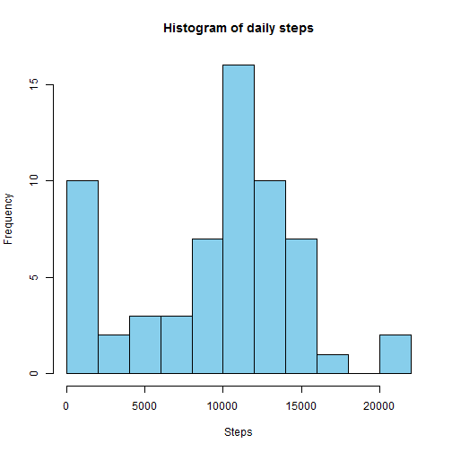
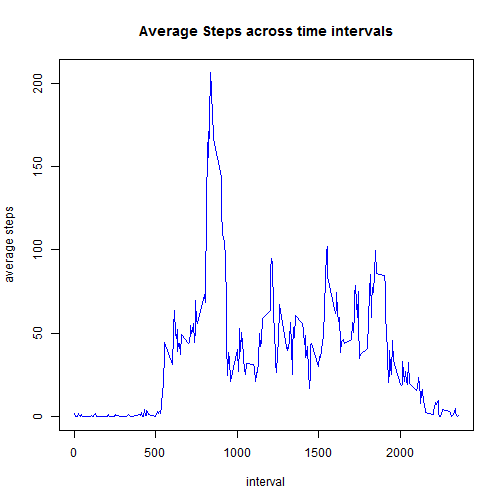
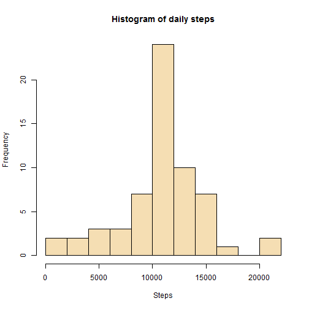
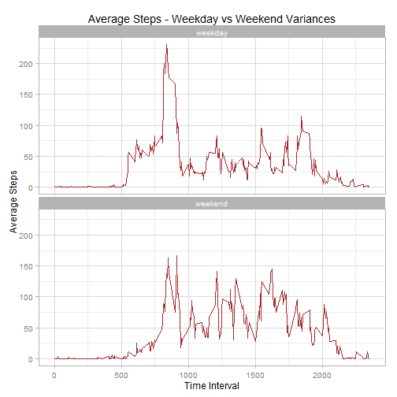

### Loading and preprocessing the data
1. Load the data

```r
activity = read.csv("activity.csv",stringsAsFactors = FALSE, header = TRUE)
str(activity)
```

```
## 'data.frame':	17568 obs. of  3 variables:
##  $ steps   : int  NA NA NA NA NA NA NA NA NA NA ...
##  $ date    : chr  "2012-10-01" "2012-10-01" "2012-10-01" "2012-10-01" ...
##  $ interval: int  0 5 10 15 20 25 30 35 40 45 ...
```

```r
head(activity)
```

```
##   steps       date interval
## 1    NA 2012-10-01        0
## 2    NA 2012-10-01        5
## 3    NA 2012-10-01       10
## 4    NA 2012-10-01       15
## 5    NA 2012-10-01       20
## 6    NA 2012-10-01       25
```
***Remarks:-***  
Data has been loaded to dataframe **activity** and verified  

2. Process/transform the data (if necessary) into a format suitable for your analysis

```r
activity$date = as.Date(activity$date)
activity = activity[c(2,3,1)]
str(activity)
```

```
## 'data.frame':	17568 obs. of  3 variables:
##  $ date    : Date, format: "2012-10-01" "2012-10-01" ...
##  $ interval: int  0 5 10 15 20 25 30 35 40 45 ...
##  $ steps   : int  NA NA NA NA NA NA NA NA NA NA ...
```

```r
head(activity)
```

```
##         date interval steps
## 1 2012-10-01        0    NA
## 2 2012-10-01        5    NA
## 3 2012-10-01       10    NA
## 4 2012-10-01       15    NA
## 5 2012-10-01       20    NA
## 6 2012-10-01       25    NA
```
***Remarks:-***   
Date field in dataframe **activity** has been transformed and columns re-ordered

### What is mean total number of steps taken per day?
1. Calculate the total number of steps taken per day

```r
library(dplyr)
result1 <-  activity %>%
    group_by(date) %>%
    summarize(total = sum(steps,na.rm = TRUE))
head(result1)
```

```
## Source: local data frame [6 x 2]
## 
##         date total
## 1 2012-10-01     0
## 2 2012-10-02   126
## 3 2012-10-03 11352
## 4 2012-10-04 12116
## 5 2012-10-05 13294
## 6 2012-10-06 15420
```
***Remarks:-***  
Total number of steps per day calculated in data frame **result1** and verified  

2. Make a histogram of the total number of steps taken each day

```r
hist(result1$total, xlab = "Steps", main = "Histogram of daily steps", col = "skyblue", breaks = 10)
```

 

***Remarks:-***   
Histogram of Total number of steps per day before imputation is calculated in **result1** and plotted as above  

3. Calculate and report the mean and median of the total number of steps taken per day

```r
mean = as.integer(mean(result1$total,na.rm = TRUE))
median = as.integer(median(result1$total,na.rm = TRUE))
print(mean);print(median)
```

```
## [1] 9354
```

```
## [1] 10395
```
***Remarks:-***   

+ Mean of total number of steps per day is **9354**
+ Median of total number of steps per day is **10395**

### What is the average daily activity pattern?
1. Make a time series plot (i.e. type = "l") of the 5-minute interval (x-axis) and the average number of steps taken, averaged across all days (y-axis)

```r
result2 <-  activity %>%
    group_by(interval) %>%
    summarize(average = mean(steps,na.rm = TRUE))
head(result2)
```

```
## Source: local data frame [6 x 2]
## 
##   interval   average
## 1        0 1.7169811
## 2        5 0.3396226
## 3       10 0.1320755
## 4       15 0.1509434
## 5       20 0.0754717
## 6       25 2.0943396
```

```r
plot(result2$interval,result2$average, type = "l", lwd = 1, col = "blue", xlab = "interval", ylab = "average steps", main = "Average Steps across time intervals"  )
```

 

2. Which 5-minute interval, on average across all the days in the dataset, contains the maximum number of steps?

```r
stepmax = result2[which.max(result2$average),]$average
stepmaxint = result2[which.max(result2$average),]$interval
print(stepmax);print(stepmaxint)
```

```
## [1] 206.1698
```

```
## [1] 835
```
***Remarks:-***   

Maximum number of steps on average is **206** and is recorded in the interval **835**

### Imputing missing values  
1. Calculate and report the total number of missing values in the dataset (i.e. the total number of rows with NAs)

```r
countNA = sum(!complete.cases(activity))
print(countNA)
```

```
## [1] 2304
```
***Remarks:-***   

Total number of missing values in **activity** dataset is **2304**  

2. Devise a strategy for filling in all of the missing values in the dataset. The strategy does not need to be sophisticated. For example, you could use the mean/median for that day, or the mean for that 5-minute interval, etc.

```r
result3 = merge(activity,result2,by="interval",all.x = TRUE)
result3$stepsimpute = as.numeric(ifelse(is.na(result3$steps), floor(result3$average),result3$steps))
result3 = result3[order(result3$date,result3$interval),]
head(result3)
```

```
##     interval       date steps   average stepsimpute
## 1          0 2012-10-01    NA 1.7169811           1
## 63         5 2012-10-01    NA 0.3396226           0
## 128       10 2012-10-01    NA 0.1320755           0
## 205       15 2012-10-01    NA 0.1509434           0
## 264       20 2012-10-01    NA 0.0754717           0
## 327       25 2012-10-01    NA 2.0943396           2
```
***Remarks:-***   

Missing steps data have been filled in by calculating the average across all days for the particular 5 minute interval

3. Create a new dataset that is equal to the original dataset but with the missing data filled in

```r
activityimpute = result3[c(2,1,5)]
activityimpute$stepsimpute = as.integer(activityimpute$stepsimpute)
head(activityimpute)
```

```
##           date interval stepsimpute
## 1   2012-10-01        0           1
## 63  2012-10-01        5           0
## 128 2012-10-01       10           0
## 205 2012-10-01       15           0
## 264 2012-10-01       20           0
## 327 2012-10-01       25           2
```
***Remarks:-***   

New dataset **activityimpute** created with imputed values for **steps** data

4. Make a histogram of the total number of steps taken each day and Calculate and report the mean and median total number of steps taken per day. Do these values differ from the estimates from the first part of the assignment? What is the impact of imputing missing data on the estimates of the total daily number of steps?

```r
result4 <-  activityimpute %>%
    group_by(date) %>%
    summarize(total = sum(stepsimpute))
head(result4)
```

```
## Source: local data frame [6 x 2]
## 
##         date total
## 1 2012-10-01 10641
## 2 2012-10-02   126
## 3 2012-10-03 11352
## 4 2012-10-04 12116
## 5 2012-10-05 13294
## 6 2012-10-06 15420
```

```r
hist(result4$total, xlab = "Steps", main = "Histogram of daily steps", col = "wheat", breaks = 10)
```

 

***Remarks:-***  

Histogram tails are narrower and peak sharper after imputation

```r
mean1 = as.integer(mean(result4$total))
median1 = as.integer(median(result4$total))
print(mean1);print(median1)
```

```
## [1] 10749
```

```
## [1] 10641
```

```r
meanchg = as.integer((mean1-mean)/mean*100)
medianchg = as.integer((median1-median)/median*100)
print(meanchg);print(medianchg)
```

```
## [1] 14
```

```
## [1] 2
```
***Remarks:-***  

+ New mean of total number of steps per day is **10749**
+ New median of total number of steps per day is **10641**
+ Mean has **increased** by **14%** and Median by **2%** after imputation

### Are there differences in activity patterns between weekdays and weekends?

```r
library(lubridate)
library(ggplot2)
activityimpute$weekind = as.factor(ifelse(wday(as.Date(activityimpute$date)) %in% c(2,3,4,5,6),"weekday","weekend"))
head(activityimpute)
```

```
##           date interval stepsimpute weekind
## 1   2012-10-01        0           1 weekday
## 63  2012-10-01        5           0 weekday
## 128 2012-10-01       10           0 weekday
## 205 2012-10-01       15           0 weekday
## 264 2012-10-01       20           0 weekday
## 327 2012-10-01       25           2 weekday
```

```r
result5 <-  activityimpute %>%
    group_by(weekind,interval) %>%
    summarize(avg= mean(stepsimpute))
head(result5)
```

```
## Source: local data frame [6 x 3]
## Groups: weekind
## 
##   weekind interval        avg
## 1 weekday        0 2.15555556
## 2 weekday        5 0.40000000
## 3 weekday       10 0.15555556
## 4 weekday       15 0.17777778
## 5 weekday       20 0.08888889
## 6 weekday       25 1.57777778
```

```r
ggplot(result5, 
       aes(x=interval, y=avg)) + 
    geom_line(color = "brown") + theme_light() +
    labs(x = "Time Interval", y = "Average Steps", title ="Average Steps - Weekday vs Weekend Variances") +
    facet_wrap(~weekind, nrow = 2)
```

 

***Remarks:-***  

+ Week day steps show more peaks and lows whereas weekend pattern is relatively consistent throughout  
+ Week day activities tend to start early and end early whereas weekend activities start relatively late and end relatively late too

